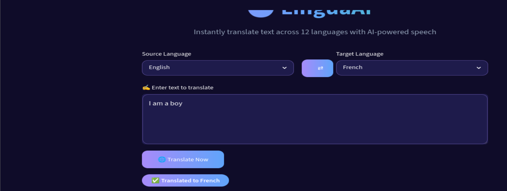

# LinguaAI — Multilingual Translator with Text-to-Speech

A Streamlit web app that translates text across 12 languages — including three Nigerian languages (Yoruba, Hausa, Igbo) — and reads the translation aloud using AI-generated speech.

Built as part of an AI internship with **CodeAlpha**.



## What it does

Type text in one language, pick a target language, and LinguaAI:
1. Translates the text using the MyMemory Translation API
2. Generates spoken audio of the translation using Google Text-to-Speech (gTTS), where supported
3. Displays everything in a custom dark-purple themed interface

## Supported languages

**Translation (12 languages):** English, French, Spanish, German, Italian, Portuguese, Arabic, Chinese, Japanese, Yoruba, Hausa, Igbo

**Text-to-speech (9 of the 12):** English, French, Spanish, German, Italian, Portuguese, Arabic, Chinese, Japanese

Yoruba, Hausa, and Igbo aren't in this list because gTTS (Google's text-to-speech engine) doesn't currently support them. Rather than silently failing or showing a broken player, the app detects this and shows a clear notice instead: *"Text-to-speech is not available for [language] yet."*

## Why a 12/9 split instead of just supporting 9 languages

Translation and speech synthesis rely on two different underlying services with different language coverage. Limiting the whole app to only the 9 TTS-supported languages would mean dropping Yoruba, Hausa, and Igbo entirely — three languages with real, underserved demand for digital tools. Instead, the app treats translation and speech as independent features: translation covers all 12, speech covers what's currently possible, and the gap is communicated honestly rather than hidden.

## Tech stack

| Tool | Role |
|---|---|
| **Streamlit** | Web app framework and UI |
| **MyMemory Translation API** | Text translation |
| **gTTS (Google Text-to-Speech)** | Audio generation for supported languages |
| **Custom CSS** | Dark purple theme, gradient text, styled components |

## Notable technical decisions

- **Language-code correction for Chinese audio**: gTTS requires the specific code `zh-TW` to generate Chinese speech — the generic `zh` code (used for translation) doesn't work for audio. The app detects this and swaps the code only for the TTS call, without affecting translation.
- **Graceful fallback over silent failure**: rather than attempting TTS for every language and letting unsupported ones error out, the app checks language support upfront and shows an honest, styled notice when audio isn't available.
- **Temporary file handling for audio**: each generated audio clip is written to a temporary `.mp3` file via Python's `tempfile` module and streamed directly into Streamlit's native audio player, avoiding permanent file clutter.
- **Theme applied at two levels**: the dark purple aesthetic is set both in `.streamlit/config.toml` (Streamlit's native theme system) and via inline CSS injected into the page (for custom elements like the gradient title and styled text areas) — since Streamlit's built-in theming alone doesn't cover custom HTML components.

## Project structure

```
.
├── app.py                   # Main application
├── requirements.txt         # Python dependencies
├── .streamlit/
│   └── config.toml          # Theme configuration
├── assets/
│   └── screenshot.png       # App screenshot
└── README.md
```

## Running it locally

```bash
git clone https://github.com/OGO-1/CodeAlpha_LanguageTranslationTool.git
cd CodeAlpha_LanguageTranslationTool
pip install -r requirements.txt
streamlit run app.py
```

The app will open in your browser at `localhost:8501`.

## Live demo

🔗 [Try LinguaAI live](https://codealphalanguagetranslationtool-2rwmxmgk39wuga8hzcwinw.streamlit.app)

## A note on the development environment

This app was built and tested inside a Kali Linux VM (VMware Workstation). During development, audio playback inside that specific VM setup occasionally stuttered — a virtualization/audio-passthrough quirk of the development environment itself, unrelated to the app's logic. The live demo above runs on Streamlit Cloud and isn't affected by this.

## About this project

Built by **Awofodu Elijah Oluwafolahanmi** as part of an AI internship with **CodeAlpha**, focused on practical Python application development, API integration, and thoughtful UX for multilingual accessibility.

- GitHub: [OGO-1](https://github.com/OGO-1)
- LinkedIn: [linkedin.com/in/folikyz](https://linkedin.com/in/folikyz)
